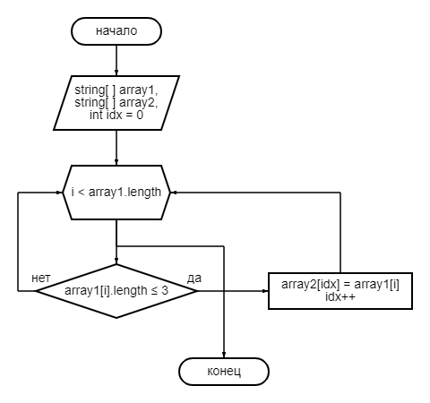

# Задание

*Написать программу, которая из имеющегося массива строк формирует массив из строк, длина которых меньше либо равна 3 символа. Первоначальный массив можно ввести с клавиатуры, либо задать на старте выполнения алгоритма. При решение не рекомендуется пользоваться коллекциями, лучше обойтись исключительно массивами*

**Решение**

1. Объявить два массива одинаковой длины
2. Создать метод, на вход принимает оба массива. Внутри создать локальную переменную idx = 0, и запустить цикл for
3. Внутри цикла проверять условие (<= 3), если да, то элемент заносится в idx элемент второго массива. После этого idx увеличиваем на 1, и i внутри цикла также увеличится на 1.
4. Создать метод для вывода массива

*блок схема для метода в пунктах 2 и 3 представлена ниже:*

РЕШЕНИЕ ЗАДАНИЯ В ПАПКЕ solution

